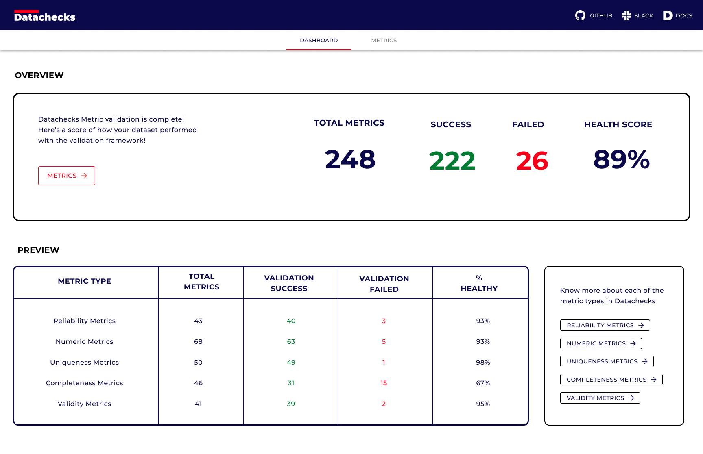

# **Getting Started**

You can easily launch this example in just 5 minutes.

## Installation

### MAC OS and Linux

Install Datachecks using the pip package manager.
Below we are installing the package with the **postgres extra**, which is required for this example.

```bash
pip install 'datachecks[postgres]' -U
```
## Quick Setup of Database & Test Data
> Ignore if you already have a PostgreSql setup

??? "Create a SQL file"

    Create a sql file named `init.sql` with the following contents:
    ```sql title="init.sql"
    CREATE TABLE IF NOT EXISTS products (
        id INTEGER PRIMARY KEY,
        name TEXT,
        category TEXT,
        country_code TEXT,
        price INTEGER
    );
    INSERT INTO products VALUES
        (1, 'Apple', 'Fruit', 'IN', 100),
        (2, 'Orange', 'Fruit', 'IN', 80),
        (3, 'Banana', 'Fruit', 'IN', 50),
        (4, 'Mango', 'Fruit', 'IN', 150),
        (5, 'Pineapple', 'Fruit', 'IN', 200),
        (6, 'Papaya', 'Fruit', 'IN', 100),
        (7, 'Grapes', 'Fruit', 'IN', 120),
        (8, 'Strawberry', 'Fruit', 'IN', 300),
        (9, 'Kiwi', 'Fruit', 'US', 200),
        (10, 'Watermelon', 'Fruit', 'US', 100);
    ```

??? "Postgres Docker Compose file"


    Create a `docker-compose.yml` for postgres:

    ```yaml title="docker-compose.yaml"
    version: '3'
    services:
      dcs-demo-postgres:
        container_name: dcs-demo-postgres
        image: postgres
        environment:
          POSTGRES_DB: dcs_demo
          POSTGRES_USER: dbuser
          POSTGRES_PASSWORD: dbpass
          PGDATA: /data/postgres
        volumes:
          - dcs-demo-postgres:/data/postgres
          - ./init.sql:/docker-entrypoint-initdb.d/init.sql
        ports:
          - "5431:5432"
        networks:
          - dcs-demo-postgres
        restart: unless-stopped

    networks:
      dcs-demo-postgres:
        driver: bridge

    volumes:
      dcs-demo-postgres:
        driver: local
    ```

## Datachecks Configuration File

Create a configuration file `dcs_config.yaml` with the following contents:

```yaml title="dcs_config.yaml"
data_sources:
  - name: product_db
    type: postgres
    connection:
      host: 127.0.0.1
      port: 5431
      username: dbuser
      password: dbpass
      database: dcs_demo
metrics:
  - name: count_of_products
    metric_type: row_count
    resource: product_db.products
    validation:
      threshold: "> 0 & < 1000"
  - name: max_product_price_in_india
    metric_type: max
    resource: product_db.products.price
    filters:
      where: "country_code = 'IN'"
    validation:
      threshold: "< 190"
```

## Run Datachecks

Datachecks can be run in two ways using the CLI or the Python API.

### Run Datachecks in CLI

```bash
datachecks inspect --config-path ./dcs_config.yaml
```

While running the above command, you should see the following output:


### Generate Metrics Validation Report
    
You can generate a beautiful data quality report with all the metrics with just one command.
This html report can be shared with the team.

```bash
datachecks inspect --config-path ./dcs_config.yaml --html-report
```


### Run Datachecks in Python

```python
from datachecks.core import load_configuration, Inspect


if __name__ == "__main__":
    inspect = Inspect(load_configuration("dcs_config.yaml"))
    inspect_output = inspect.run()
    print(inspect_output.metrics)
    # User the metrics to send or store somewhere
    # It can be sent to elk or any time series database
```